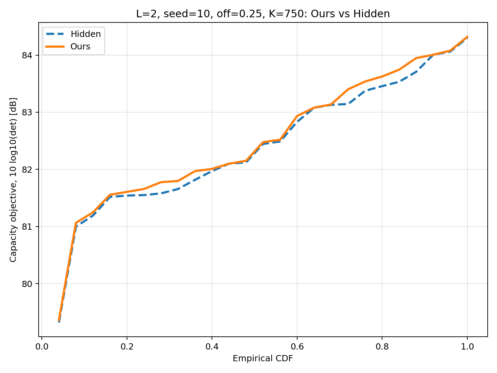
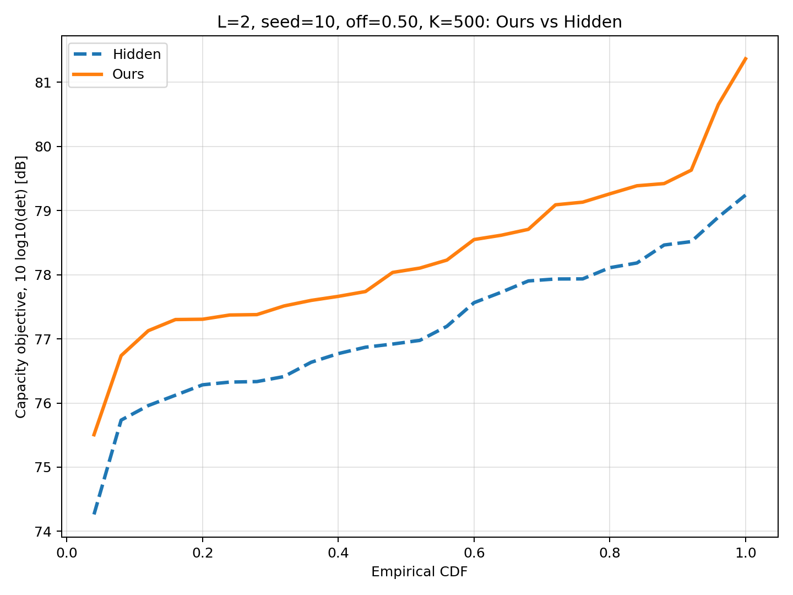
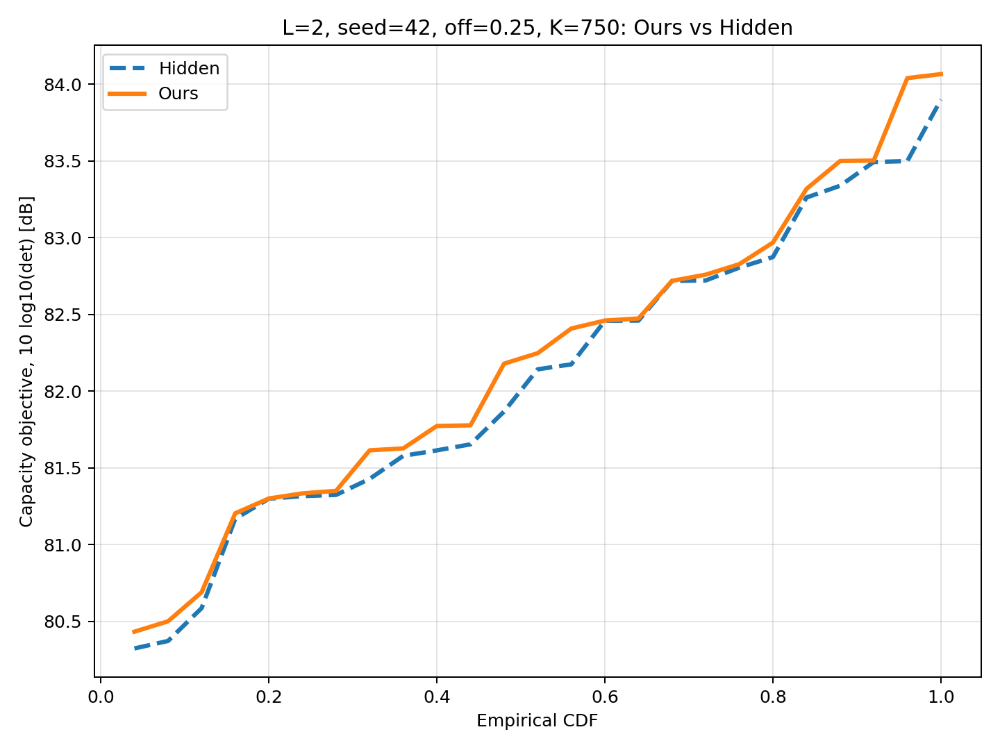
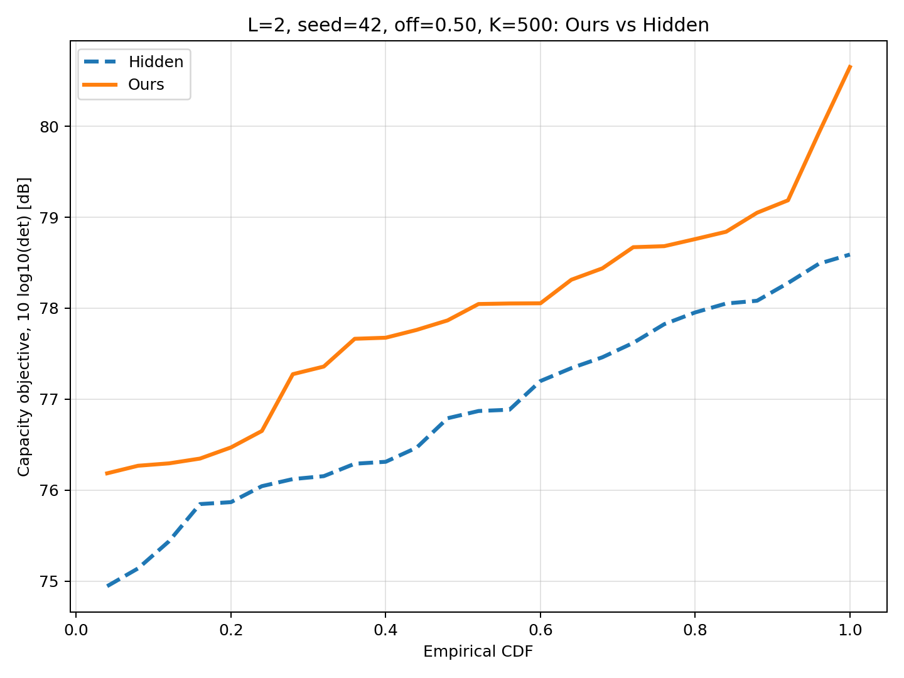
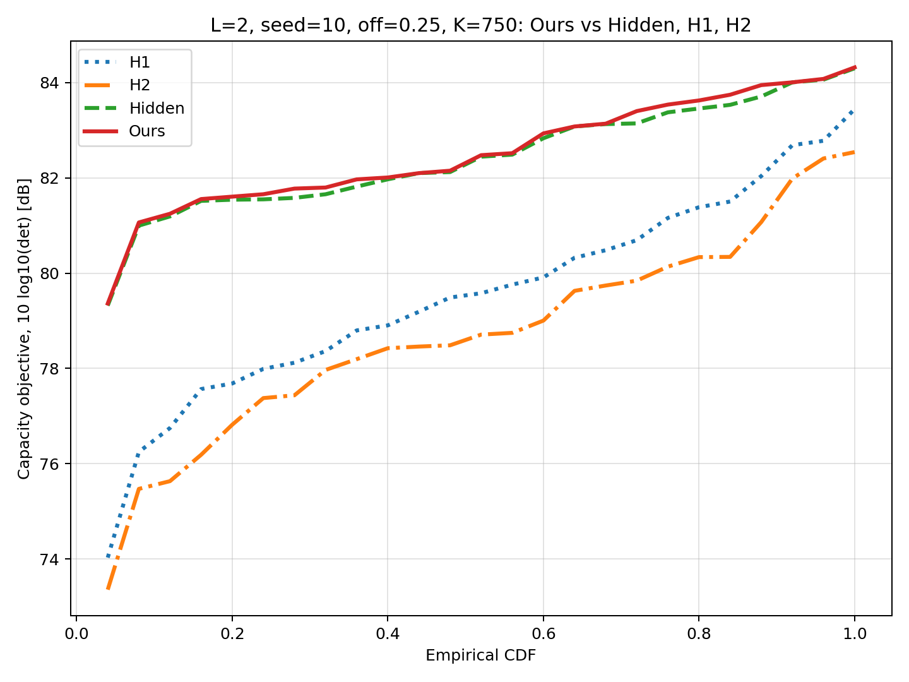
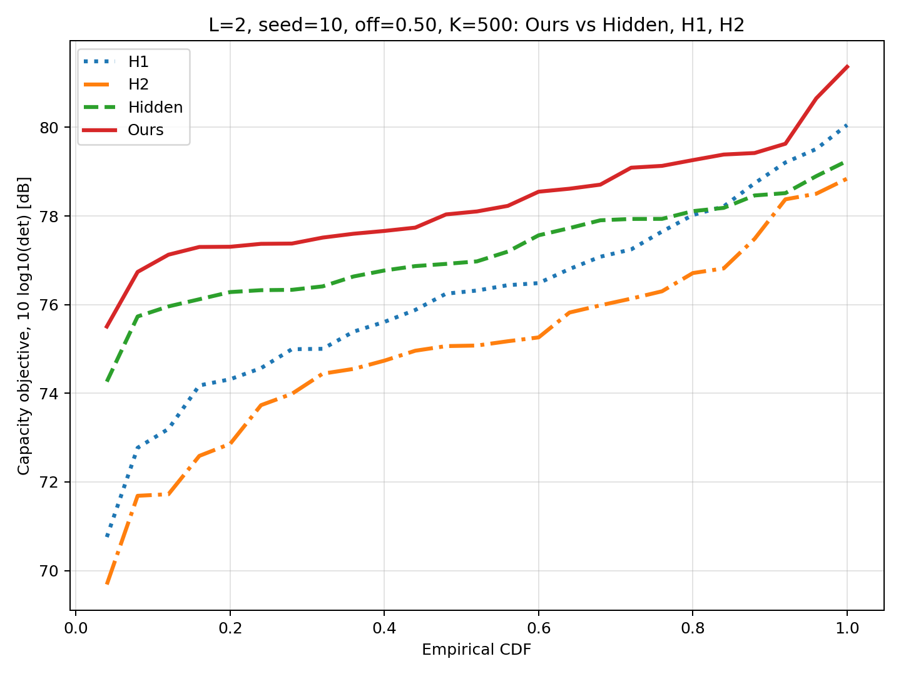
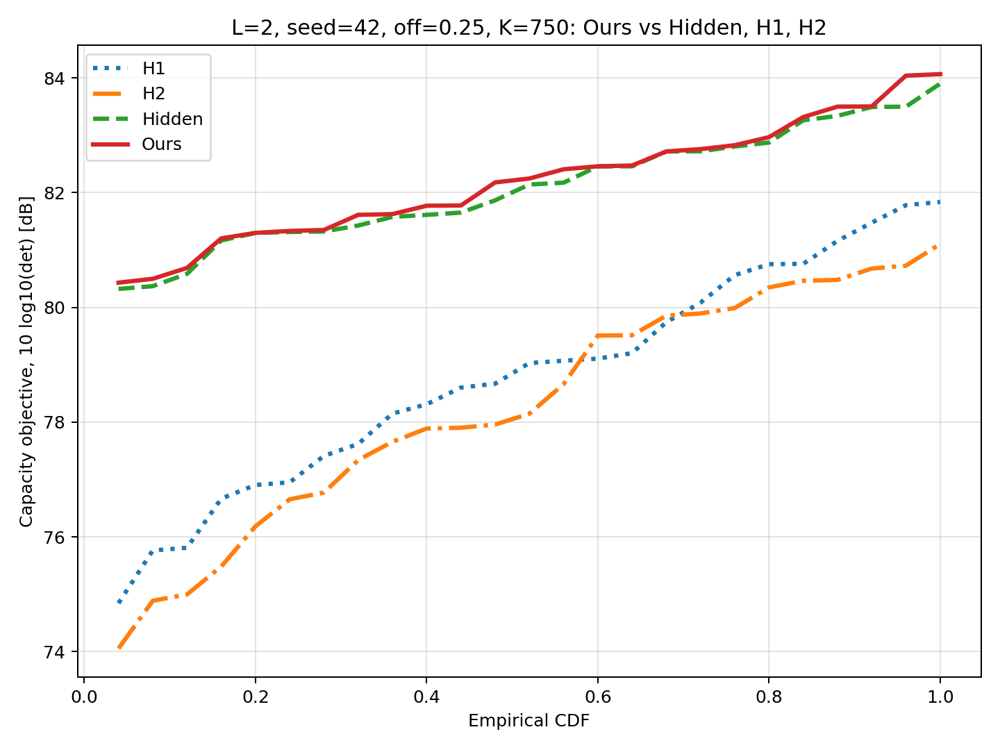
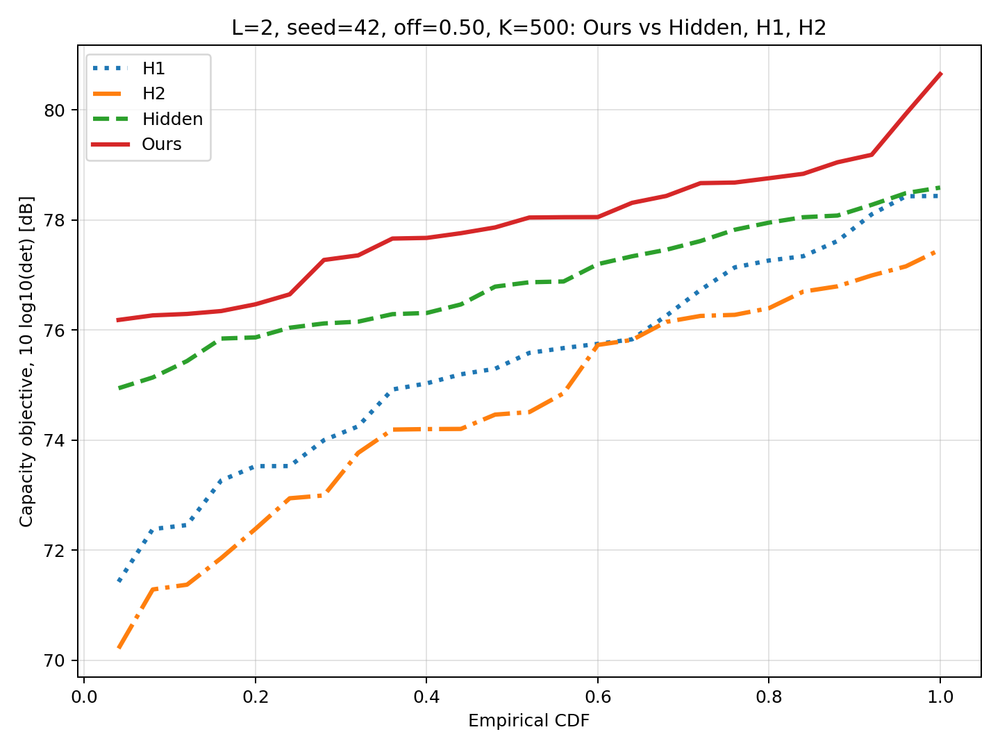

# Ours vs Hidden, L=2, 100 Tests Using Seeds 10 and 42

## Setup

- N: 1000
- L: 2
- Tests: 100
- Seeds: [10, 42]
- Switch-off ratios: [0.25, 0.5]
- Random matrices per seed: 25
- Active K values: off=0.25 -> K=3N/4=750, off=0.5 -> K=N/2=500
- Generator: exactly the appendix style. For each seed, `np.random.seed(seed)` is set once, then each call to `generate_V` draws a new random matrix from the fixed reproducible sequence.
- Objective in dB: `10 log10(det(V_eff V_eff* + sigma I))`, `sigma=1`
- Final proposed method: `solve_general` (`Ours`)
- Comparator: hidden weak+strong heuristic

The fixed seed makes the sequence reproducible, but the generated matrices are still random draws; the CSV contains no repeated benchmark rows.

## Summary

| Method | Mean dB | Median dB | Min dB | Max dB |
|---|---:|---:|---:|---:|
| H1 | 77.493 | 77.593 | 70.757 | 83.444 |
| H2 | 76.670 | 76.706 | 69.687 | 82.542 |
| Hidden weak+strong | 79.646 | 79.281 | 74.263 | 84.301 |
| Ours | 80.241 | 80.575 | 75.506 | 84.319 |

## Ours minus Hidden

- Mean delta: 0.594 dB
- Median delta: 0.197 dB
- Min delta: 0.000006 dB
- Max delta: 2.375 dB
- Ours better than hidden: 100 / 100 tests
- Ours worse than hidden: 0 / 100 tests

## Mean by Seed and Switch-off Ratio

| seed | off | cases | Hidden mean dB | Ours mean dB | Mean delta dB |
|---:|---:|---:|---:|---:|---:|
| 10 | 0.25 | 25 | 82.437 | 82.524 | 0.087 |
| 10 | 0.50 | 25 | 77.171 | 78.297 | 1.126 |
| 42 | 0.25 | 25 | 82.095 | 82.203 | 0.108 |
| 42 | 0.50 | 25 | 76.882 | 77.939 | 1.057 |

## Best and Worst Individual Deltas

| case | seed | sample | off | Hidden dB | Ours dB | Delta dB | Ours method |
|---:|---:|---:|---:|---:|---:|---:|---|
| 17 | 10 | 9 | 0.25 | 82.100 | 82.100 | 0.000006 | H3-hidden+swap |
| 83 | 42 | 17 | 0.25 | 82.460 | 82.460 | 0.000111 | H3-hidden+swap |
| 85 | 42 | 18 | 0.25 | 83.500 | 83.500 | 0.000145 | H3-hidden+swap |
| 90 | 42 | 20 | 0.50 | 76.154 | 78.313 | 2.159 | H1+swap |
| 38 | 10 | 19 | 0.50 | 78.464 | 80.655 | 2.191 | greedy+swap |
| 54 | 42 | 2 | 0.50 | 78.277 | 80.651 | 2.375 | H1+swap |

## CDF

### Ours vs Hidden

### H1, H2, Hidden, Ours

## Runtime

- Total script time: 329.78 seconds
